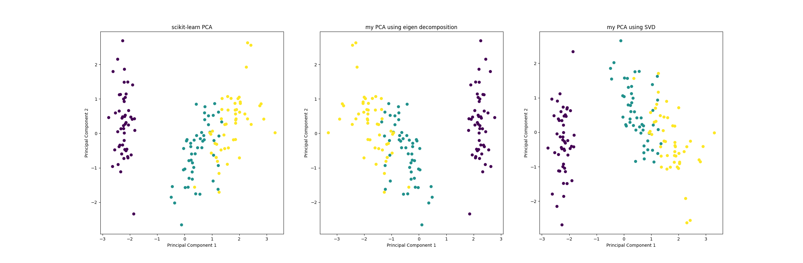

# Principal Component Analysis

This is a python implementation of principal component analysis using both **eigen decomposition** and **singular value decomposition**

The comparison between sklearn's PCA implementation and my PCA implementation on iris dataset

As you can see from the image above that three principal component plots vary from each other, this is because the sign of principal components (eigenvectors) obtained by using sklearn's implementation of PCA and my implementation of PCA are different. 

**scikit-learn implementation of PCA**: 
explained variance ratio: 
 [0.72962445 0.22850762 0.03668922 0.00517871]
components (eigenvectors): 
 [[ 0.52106591 -0.26934744  0.5804131   0.56485654]
 [ 0.37741762  0.92329566  0.02449161  0.06694199]
 [-0.71956635  0.24438178  0.14212637  0.63427274]
 [-0.26128628  0.12350962  0.80144925 -0.52359713]]

**my implementation of PCA (eigen decomposition)**: 
explained variance ratio: 
 [0.72962445 0.22850762 0.03668922 0.00517871]
components (eigenvectors): 
 [[-0.52106591  0.26934744 -0.5804131  -0.56485654]
 [ 0.37741762  0.92329566  0.02449161  0.06694199]
 [ 0.71956635 -0.24438178 -0.14212637 -0.63427274]
 [ 0.26128628 -0.12350962 -0.80144925  0.52359713]]

**my implementation of PCA (SVD)**: 
explained variance ratio: 
 [0.72962445 0.22850762 0.03668922 0.00517871]
components (eigenvectors): 
 [[ 0.52106591 -0.26934744  0.5804131   0.56485654]
 [-0.37741762 -0.92329566 -0.02449161 -0.06694199]
 [ 0.71956635 -0.24438178 -0.14212637 -0.63427274]
 [ 0.26128628 -0.12350962 -0.80144925  0.52359713]]

However, since PCA is a mathematical transformation that aims to find axis that retain as much variance as possible from original data, and principal components are vectors that has different direction thus if I change the signs of the components, it does not change the variance that is contained in each component. Thus signs do not change the interpretation of PCA and therefore it doesn't matter if you end up with eigenvectors with different sign.