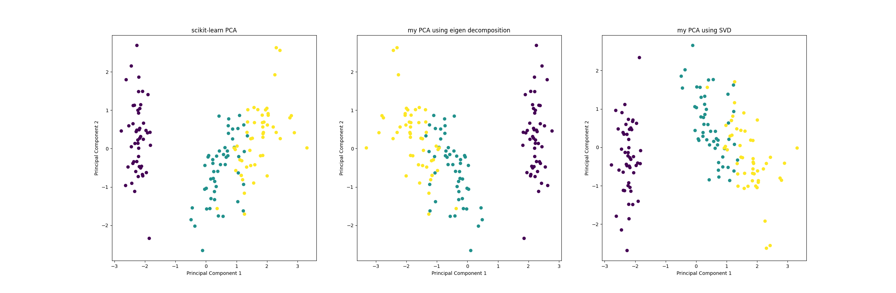

# Principal Component Analysis

This is a python implementation of principal component analysis using both **eigen decomposition** and **singular value decomposition**

The comparison between sklearn's PCA implementation and my PCA implementation
